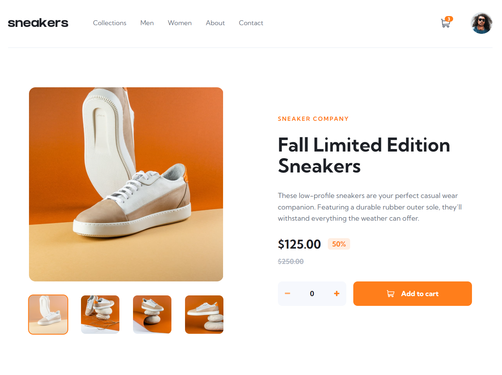
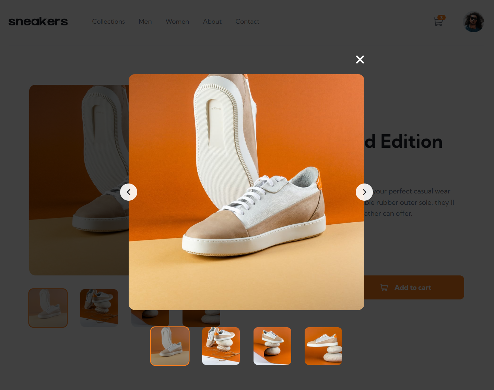
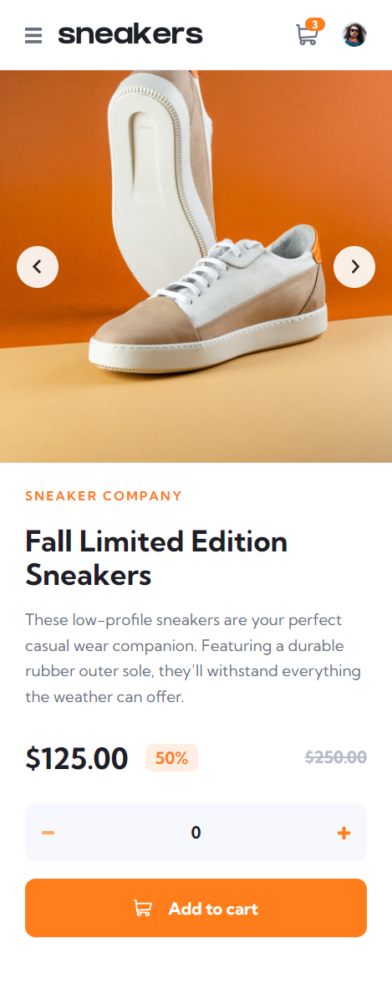

# Frontend Mentor - E-commerce product page solution

This is a solution to the [E-commerce product page challenge on Frontend Mentor](https://www.frontendmentor.io/challenges/ecommerce-product-page-UPsZ9MJp6). Frontend Mentor challenges help you improve your coding skills by building realistic projects.

### Links

- Solution URL: https://github.com/aaronrubinstein/ecommerce-product-page
- Live Site URL: https://aaronrubinstein.github.io/ecommerce-product-page/

### Screenshots

**Desktop**

**Lightbox**

**Mobile**

